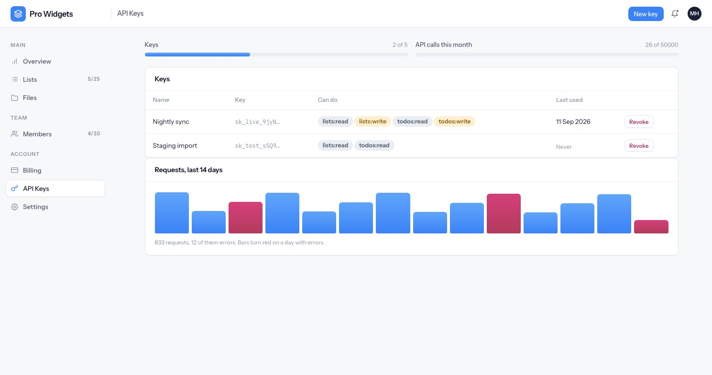

# The API

A JSON API at `/api/v1`, authenticated with a workspace API key. The key *is* the tenant scope — no
endpoint takes a workspace id, because that would be a way to ask for somebody else's.

Available on Pro and Business. The plan is checked on **every** request, so a downgrade closes the
API immediately rather than at the next key rotation.

---

## Keys



Keys are created by an owner, in the web app. The secret looks like `sk_live_…` or `sk_test_…` and
is **shown exactly once**, at creation.

- Only the first 12 characters and a SHA-256 hash of the whole secret are stored. The plaintext is
  never persisted and never logged.
- The hash is unsalted and fast on purpose: the secret is 32 random characters, so there is no
  dictionary to attack, and a slow hash would add time to every API call.
- Unknown, revoked and expired keys all produce the **same 401**. You cannot probe a key to learn
  whether it once existed.
- "Last used" updates at most once a minute, so it is a recency hint rather than a live clock.

### Scopes

`lists:read`, `lists:write`, `todos:read`, `todos:write`, `members:read`. A key created without an
explicit choice is **read-only**. A request missing a scope gets a 403 that names the scope it
needed.

---

## Endpoints

```
GET    /api/v1/organization            plan, limits and current usage
GET    /api/v1/members

GET    /api/v1/lists
POST   /api/v1/lists
GET    /api/v1/lists/:id
PATCH  /api/v1/lists/:id
DELETE /api/v1/lists/:id

GET    /api/v1/lists/:listId/todos
POST   /api/v1/lists/:listId/todos
GET    /api/v1/todos/:id
PATCH  /api/v1/todos/:id
DELETE /api/v1/todos/:id
POST   /api/v1/todos/:id/complete
POST   /api/v1/todos/:id/uncomplete
```

`GET /organization` needs no scope, so an integration can check its headroom before starting a bulk
import.

Ids on the wire are prefixed public ids: `lst_` for lists, `tdo_` for todos, `usr_` for people,
`key_` for API keys and `fil_` for files.

**Pagination is cursor-based.** The cursor is opaque, the default page is 25 and the maximum is 100.
A cursor that makes no sense restarts from the beginning rather than failing.

---

## Errors

Always this shape:

```json
{
  "error": {
    "code": "insufficient_scope",
    "message": "This key cannot write todos.",
    "details": { "required_scope": "todos:write" }
  }
}
```

| Code | Status |
|---|---|
| `unauthorized` | 401 |
| `forbidden`, `insufficient_scope` | 403 |
| `not_found` | 404 |
| `validation_failed` | 422 |
| `plan_limit_exceeded`, `upgrade_required` | 402 |
| `rate_limit_exceeded` | 429 |
| `server_error` | 500 |

Whether a response is JSON is decided by the URL prefix, not the `Accept` header, so a client that
forgets the header still gets JSON rather than an HTML error page.

{: .warning }
`plan_limit_exceeded` is **not retryable**. It carries the limit, what is allowed, what is used and
an upgrade URL. Check `GET /organization` rather than retrying into a wall.

---

## Rate limits

Two limits apply to every call:

- **Burst** — 120 requests per minute, per key. About service stability, not your plan.
- **Monthly quota** — per workspace, per calendar month: 50,000 on Pro, 1,000,000 on Business. It
  resets on the first of the month, which is the same boundary the invoice uses.

Every response carries `x-ratelimit-limit`, `x-ratelimit-remaining` and `x-ratelimit-reset`, and —
where the plan has one — `x-quota-limit`, `x-quota-remaining` and `x-quota-reset`. A 429 adds
`retry-after`. A well-behaved client can slow down before it hits the wall instead of after.

---

## Usage figures

Every `/api/*` request is recorded, including the 401s and 402s — those are the ones customers write
in about. Recording is fire-and-forget: it can never slow down or fail the actual response.

The "requests, last 14 days" chart merges a nightly rollup with today's raw rows, since today has no
rollup yet, and zero-fills quiet days so a weekend does not look like an outage. An **error** is any
response of 400 or above. Raw rows are pruned after 30 days, but only for days already rolled up.

---

## The contract

- `GET /openapi.json` — the OpenAPI document, hand-written and treated as a deliberate contract
  rather than generated from the code.
- `GET /docs` — a readable viewer for it.

Both are public.
