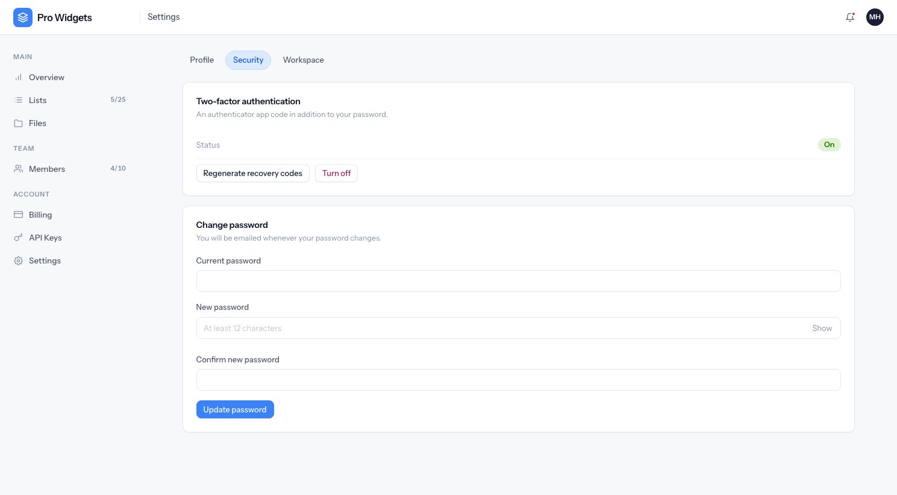

# Authentication

Two separate guards: customers on one table, staff on another. Everything below applies to
customers unless it says otherwise.

---

## Signing up

`/signup` creates a user and their workspace in one transaction. If no workspace name is given, one
is derived from the person's name or email local part.

A verification email goes out, and **the user is signed in immediately** — unverified. The rest of
the application is gated behind verification, so an unverified account lands on a "check your email"
notice with a resend button (limited to three per hour).

Verification links last 48 hours. Following one verifies the address and signs the user in if they
are not already, on the grounds that possession of the link is stronger proof than a password.

---

## Signing in

Password sign-in, optionally Google or GitHub, then two-factor if the account has it.

- **Passwords are hashed with scrypt** and must be at least 12 characters. A workspace holds a whole
  team's data, which is why this is above the usual eight.
- **A removed account is rejected with the same message as a wrong password**, so the form cannot be
  used to find out who has an account here.
- **Password reset always reports success**, whether or not the address exists. Reset links last one
  hour. Resetting also verifies the address, and two-factor still applies afterwards.

{: .warning }
There is no "remember me", despite the checkbox-shaped field in the login validator. Persistent
login tokens are switched off for both guards and the field is never read. Sessions are cookie
sessions.

### Social sign-in

Google and GitHub, both optional — the buttons appear only when the credentials are configured, so
a fresh clone simply doesn't show them. On callback, in order:

1. A linked account signs straight in.
2. Otherwise, if the provider says the email is **verified** and it matches an existing account, the
   two are linked. An unverified provider email is never matched against an existing account: that
   is an account-takeover route.
3. Otherwise a new workspace is created, with no password set.

Accounts created this way have no password, so changing it later skips the "current password" step
there is nothing to check against.

---

## Two-factor

Optional for customers, **mandatory for staff** — a staff member without it is refused at the login
screen until an administrator enrols them.

- TOTP, with a one-step grace either side for clock drift.
- The secret and the recovery codes are **encrypted at rest**, and recovery codes are additionally
  stored only as hashes.
- Enrolment is two steps: a secret is stored unconfirmed, and only a correct code confirms it. An
  abandoned enrolment therefore never locks anybody out — two-factor counts as "on" only when both a
  secret and a confirmation exist.
- Confirming produces **eight single-use recovery codes**, shown exactly once. Regenerating
  invalidates all the previous ones.
- The challenge box takes either a TOTP code or a recovery code.
- The half-signed-in state lives in the session for ten minutes, not in the auth guard, and allows
  ten attempts per fifteen minutes.

### The development bypass

`DEV_TWO_FACTOR_CODE` makes one fixed code acceptable, so seeded demo accounts can be signed into
without an authenticator app. It requires **both** `NODE_ENV=development` and the variable being
set, never applies in tests or production, and logs a warning every time it is used. Leave it unset
anywhere that is not a laptop.

For a genuine code instead: `node ace dev:totp admin@example.com`.

---

## Tokens

Verification, password-reset and invitation tokens all work the same way:

- 32 random bytes, and **only the SHA-256 hash is stored**. The plaintext exists in the email and
  the URL, nowhere else — which is why a lost link cannot be recovered, only reissued.
- Issuing a new token of the same kind invalidates the previous one.
- Redeeming locks the row first, so a link followed twice at once cannot be used twice.

---

## Rate limits

Every limiter counts **all** attempts, not just failures — a correct password spends a point exactly
like a wrong one.

| Surface | Limit | Keyed by |
|---|---|---|
| Guest pages overall | 60 / 5 min | IP |
| Login | 10 / 15 min | IP + account |
| Sign-up | 5 / hour | IP |
| Password reset | 3 / hour | Account |
| Verification resend | 3 / hour | Account or IP |
| Two-factor challenge | 10 / 15 min | Pending challenge, or IP |
| Staff login | 5 / 15 min | IP + account |

Accounts are keyed by a truncated hash of the address, never the address itself.

---

## Staff sign-in

`/admin/login`, a separate guard against a separate table, with two-factor compulsory. An optional
`ADMIN_IP_ALLOWLIST` puts an address check in front of the whole back office; when it refuses, it
answers **404** rather than 403, so the panel does not announce itself. It is a second layer, not the
boundary — the guard and mandatory two-factor are.

A staff account disabled mid-session is signed out on its next request rather than at expiry.
