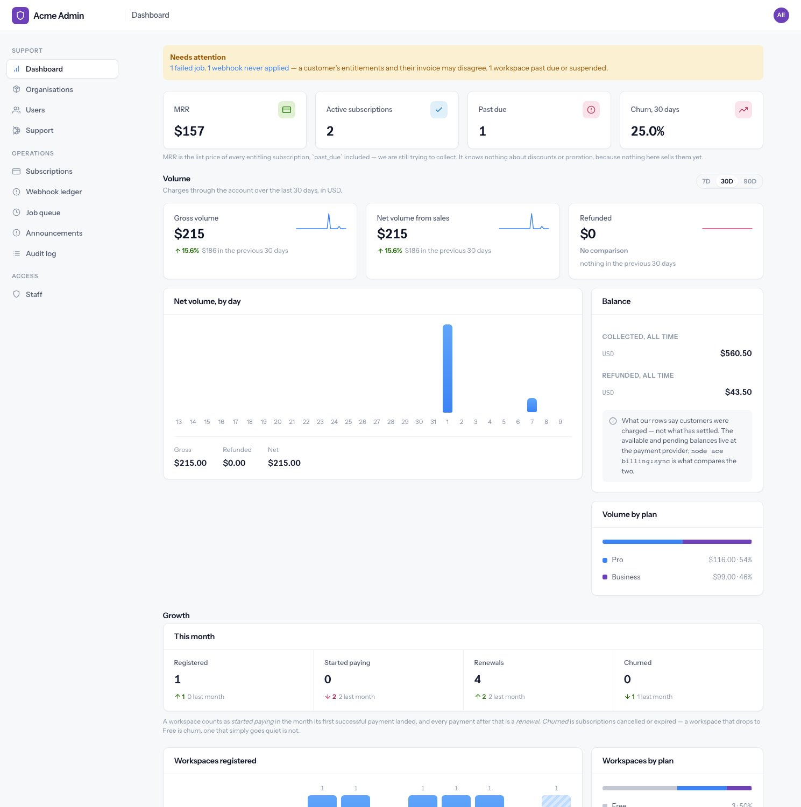
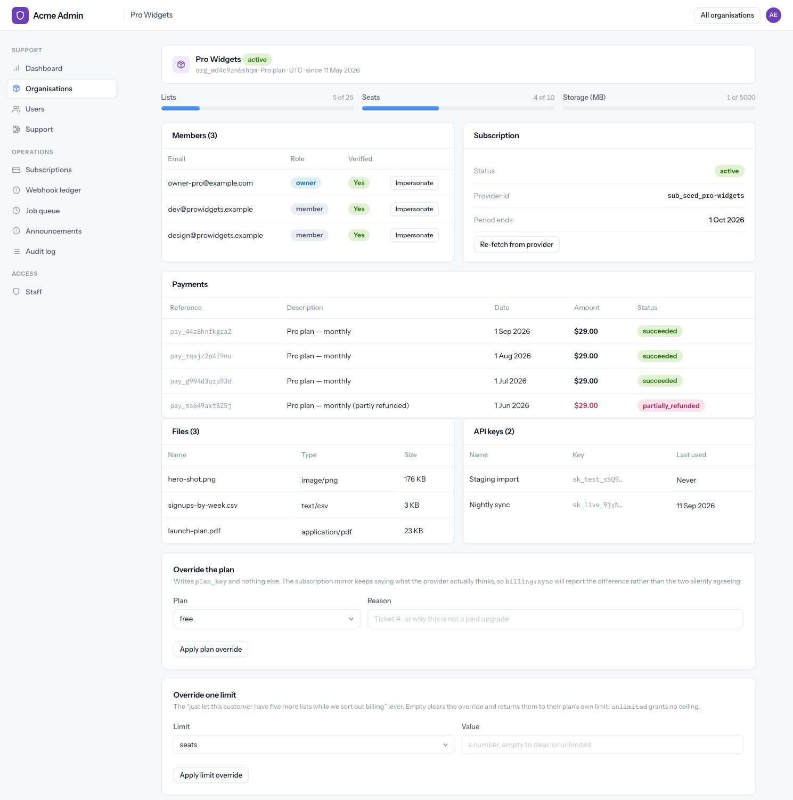
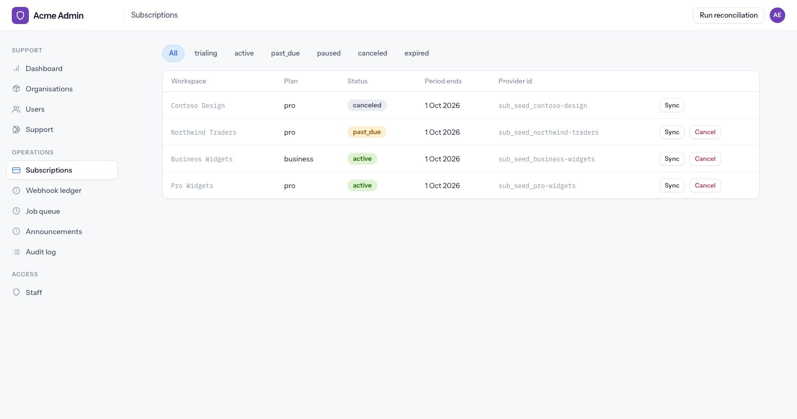

# The back office

A separate application at `/admin`, for the people who run the product. Separate table, separate
guard, separate session, compulsory two-factor.

---

## Getting in

Staff accounts are created only from the command line:

```bash
node ace staff:create --email you@example.com --name "Your Name" --role admin
```

Two-factor is not optional. An account without it is refused at the login screen rather than nudged,
and a staff account disabled mid-session is signed out on its next request.

`ADMIN_IP_ALLOWLIST` optionally puts an address check in front of the whole panel, login page
included. A non-matching address gets a **404**, so probing tells you nothing. It is exact addresses,
not ranges, and it is a second layer rather than the boundary — the guard and two-factor are that.

---

## Admin or support

Two roles, split by **blast radius rather than seniority**.

| | Support | Admin |
|---|---|---|
| Read every screen | yes | yes |
| Help a user (resend verification, verify, reset their two-factor) | yes | yes |
| Retry a job, replay a webhook, re-sync a subscription | yes | yes |
| Answer, assign and resolve support tickets | yes | yes |
| Impersonate a customer | read-only | read and write |
| Override a plan or a limit | — | yes |
| Cancel a subscription | — | yes |
| Suspend a workspace | — | yes |
| Write and publish announcements | — | yes |
| Manage staff accounts | — | yes |

Support can do everything reversible and idempotent. Anything that moves money, removes access or
grants entitlement is admin-only. Support does not even see the Staff item in the sidebar.

---

## The dashboard



Ordered deliberately: **what is broken, then what it is worth, then how it moved.**

The "needs attention" banner appears when there are failed jobs, webhooks that never applied, or
workspaces past due or suspended. The webhook clause is the one to read carefully — it means a
customer's entitlements and their invoice may disagree.

Then MRR, active subscriptions, past due and 30-day churn; then volume over 7, 30 or 90 days with
gross, net and refunded against the previous period; then growth — registrations, first payments,
renewals and churn, this month against last. See
[Billing and plans](billing-and-plans.md#the-numbers-on-the-admin-dashboard) for exactly how each
figure is derived.

The balance panel is explicitly *our* rows, not the provider's settled balance. Comparing the two is
what `node ace billing:sync` is for.

---

## A workspace, up close



Members, the subscription mirror, recent payments, usage against the plan, files, API keys and the
last twenty audit entries for that workspace.

The actions, and what they really do:

- **Suspend** — requires a reason, and it is the only thing in the system that denies access.
  Everybody in the workspace is signed out on their next request. Restoring returns it to active
  rather than guessing what it was before.
- **Override the plan** — writes the plan key and nothing else. It deliberately leaves the
  subscription mirror alone, so reconciliation afterwards reports the difference rather than the two
  quietly agreeing.
- **Override one limit** — changes a single limit. Empty clears it and hands the limit back to the
  plan; `unlimited` removes the ceiling. Those are different states.
- **Impersonate** — see below.

All of these are audited with the reason attached.

---

## Impersonation

Started from a member's row, to see what they see.

- **Support is read-only.** Every non-GET request is refused for the whole session — with one carve
  out, ending the impersonation itself, which is a POST and would otherwise trap them.
- **Admins can write**, so they can fix a thing in place.
- **Sixty minutes, absolute.** It does not extend with activity.
- **The role is fixed when the session starts.** Promoting somebody mid-session does not widen a
  live read-only impersonation — but disabling them ends it on the very next request.
- **It cannot start against a suspended workspace.**
- **Both ends are audited**, and every action taken while impersonating is attributed to the
  customer, with the staff member recorded alongside.

Leaving impersonation is a button on the customer-side banner, not a back-office screen.

---

## Operations

**Job queue.** State comes from timestamps rather than a status column: failed, running, due,
scheduled. Retry resets a failed job and releases its reservation; discard deletes it, and refuses to
touch anything still pending.

**Webhook ledger.** Every event that ever arrived, with its payload, defaulting to the ones that
never applied. Replaying is safe by construction — the handler upserts on the provider's own event
id, and it is the same code path as a live delivery. A successful replay is audited; a failure writes
the error back onto the row for the next person to read.

**Subscriptions.** Every subscription, filterable by state, with what the provider last told us and a
re-fetch button that corrects our copy toward theirs.



The demo seed plants one failed job and one stuck webhook, because an operations screen with nothing
on it teaches you nothing.

---

## The audit log

Append-only. Nothing updates a row; only retention deletes one.

Each entry records the workspace it affected, the actor (a user, a staff member, or the system), a
stable dotted action name, the subject, free-form metadata, the IP address and the user agent.
Actions are named like error codes and treated as permanent — renaming one orphans its history.

Two details worth knowing:

- **An audit write that fails is logged loudly and swallowed.** It must never fail the action it is
  describing, or somebody would retry blind and still get no record.
- **Impersonated actions are attributed to the customer**, with the staff member recorded separately
  — so the trail shows what happened to the account, and who was really at the keyboard.

{: .note }
Two gaps to be aware of rather than surprised by: retrying or discarding a job writes no audit entry,
and the actor-type filter offers `api_key` even though nothing currently records one.
