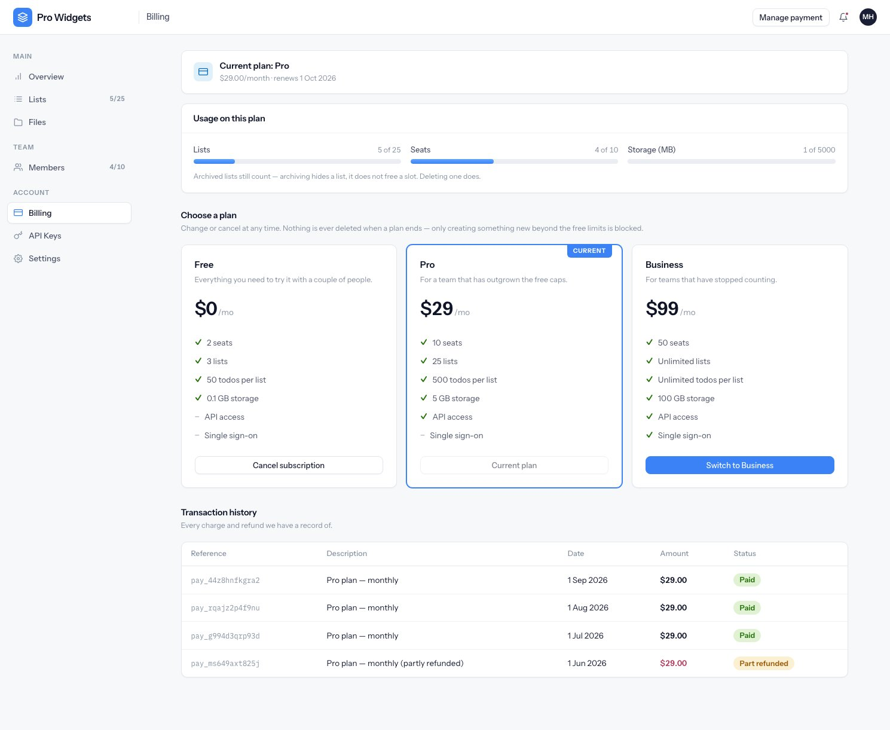
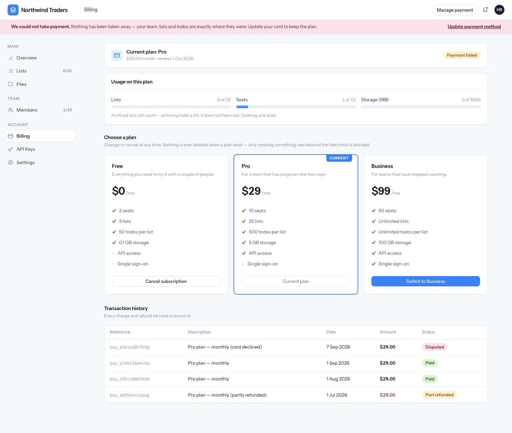

# Billing and plans

Three plans, one payment provider, and a rule that runs through all of it: **nothing is ever taken
away from a workspace that stops paying.** A plan decides what you can *create* from now on, not
what you keep.

---

## The plans

The catalogue lives in code, at `config/plans.ts`. There is no plans table, so adding a tier is a
pull request rather than a migration.

| | Free | Pro | Business |
|---|---|---|---|
| Price | $0 | $29.00/month | $99.00/month |
| Seats | 2 | 10 | 50 |
| Lists | 3 | 25 | unlimited |
| Todos per list | 50 | 500 | unlimited |
| Storage | 100 MB | 5 GB | 100 GB |
| API keys | — | 5 | 25 |
| API calls | — | 50,000/month | 1,000,000/month |

Two values in that config mean very different things, and they are easy to read the wrong way
round:

- **`null` means unlimited.** Business lists and todos are `null`.
- **`0` means the feature is not on this plan at all.** Free has `0` API keys, which is why a Free
  workspace has no API Keys screen rather than an empty one.

An unknown plan key falls back to Free rather than throwing, so retiring a plan in code never locks
out a workspace still carrying the old key.

{: .note }
The config also declares `customBranding`, `prioritySupport`, `sso` and `auditExport`. Only `api` is
actually enforced anywhere in the codebase today. Treat the other four as labels waiting for an
implementation, not as behaviour you can rely on.

---

## What a limit does when you reach it

Limits are checked when you create something, in the service layer rather than in a controller, and
for seats and lists the check and the insert happen inside one transaction that row-locks the
organization first. Two people accepting the last seat at the same moment cannot both win.

What counts toward each limit is worth stating plainly, because two of them surprise people:

- **Seats** count members **plus open invitations**. Inviting someone takes the seat immediately,
  before they accept.
- **Lists** count archived lists too. Archiving hides a list; it does not free a slot. Deleting one
  does.
- **Storage** is compared in bytes, not rounded megabytes, so an upload cannot slip in under the
  rounding.
- **Todos per list** are checked against the list's own counter.

Hitting a limit produces HTTP **402** with a code of `E_PLAN_LIMIT_EXCEEDED`. An API client gets a
JSON body carrying the limit, what is allowed, what is currently used, and an upgrade URL. A browser
gets a flash message and lands back where it was, with an inline prompt to upgrade.

A workspace that drops to a smaller plan keeps everything it already had. Ten lists on Pro stay ten
readable, editable lists on Free — you simply cannot make an eleventh. When lists or seats are
full, the owner sees a banner saying so on every screen. It appears only for owners, since nobody
else can act on it.

The usage meters turn amber at 80% of a limit:


---

## Paying

[Creem](https://creem.io) is the payment provider, behind a `PaymentProvider` interface, so the rest
of the application never talks to it directly. There is no SDK — requests are plain `fetch` calls
with a 15-second timeout.

The billing screen shows the current plan, usage against it, the plan grid and every charge:



The flow when somebody upgrades:

1. **Checkout.** The app creates a Creem checkout carrying the workspace's public id and the plan
   key in metadata. That metadata is the only thread tying the eventual webhook back to a tenant.
2. **Return.** Creem sends the customer to `/billing/return`, which grants nothing at all. It is a
   waiting screen that polls until the webhook lands. You can paste that URL into a browser and get
   nothing for it, which is the point.
3. **The webhook** does the actual work.

Card details, invoices and cancellation live in Creem's hosted portal, reached from **Manage
payment**. No card data touches this application.

---

## Webhooks

`POST /webhooks/creem` is the only route without a session, and a signature is what authenticates
it: HMAC-SHA256 over the raw body, compared in constant time. A bad signature is a 401.

A valid event is written to a ledger and queued in a single transaction, then answered `200`
immediately; the queue applies it afterwards. That keeps the response inside the provider's timeout
budget no matter how slow the work is.

The things that make this survive a bad day:

- **Retries are harmless.** A unique index on the provider's event id means a replayed delivery is
  recognised and answered `200` without doing the work twice.
- **Late events cannot undo newer ones.** Each event carries the time it happened, and an event
  older than what the subscription already reflects is dropped rather than applied. A `past_due`
  delivered after a recovery cannot resurrect the dunning state.
- **Nothing is silently lost.** An event that cannot be attributed to a workspace fails its job,
  retries with backoff, and ends up in the webhook ledger with the error attached, visible in the
  back office. `node ace billing:replay <id>` re-runs it through exactly the same code path as
  production, with no network calls.
- **A dispute never suspends anyone.** It marks the payment disputed and logs for a human.

---

## Subscription states

| State | Entitles? | What it means |
|---|---|---|
| `trialing` | yes | Trial, still inside the trial window |
| `active` | yes | Paying |
| `past_due` | **yes** | A charge failed. Dunning, not a lockout |
| `paused` | no | Entitlement drops to Free |
| `canceled` / `expired` | no | Entitlement drops to Free |

The one to notice is `past_due`. It still entitles, deliberately: the customer's team, lists and
todos are exactly where they were, and a banner asks them to fix the card.



{: .warning }
A workspace also has its own `status`, and `suspended` is a **staff action, not a billing state**.
It is the only thing in the system that actually denies access. Failing a payment never suspends
anybody. Don't conflate the two when reading the admin screens.

---

## Charges and refunds

Every Creem order becomes a row, keyed on the provider's order id so a replay updates rather than
duplicates. A refund never deletes or negates a charge: the refunded amount grows on the original
row and the status becomes `refunded` or `partially_refunded`. The history you see is therefore the
history that happened, not a netted summary.

All money is stored as **integer minor units** — cents, never floats — and formatted only at the
template edge by a `money()` helper. No controller hands a template a pre-formatted string it cannot
re-round.

The customer's transaction list shows the most recent 24 charges and is not paginated; the
provider's portal is the complete record.

---

## Staff overrides

Staff can change what a workspace is entitled to without touching the payment provider:


- **Plan override** writes the plan key directly. Useful for comping an account.
- **Limit override** changes one limit and leaves the rest of the plan alone. A value can be a
  number, the word `unlimited`, or empty to clear the override and hand the limit back to the plan.

Both are audited. Overriding the plan deliberately does **not** update the subscription mirror, so
reconciliation will afterwards report a difference between what this database says and what Creem
thinks. That difference is the visible trace of a manual decision, which beats the two silently
agreeing.

---

## Reconciliation

The subscriptions table is a **mirror**. Only webhooks and reconciliation write to it.

```bash
node ace billing:sync --dry-run   # report drift, change nothing
node ace billing:sync             # report drift, correct status
```

It walks every non-terminal subscription, asks the provider what it thinks, and compares status,
plan key and period end. It corrects **status only**. A wrong plan key or period end is reported and
left alone, because silently correcting those would paper over the missing webhook that caused them.
A subscription the provider no longer knows about is reported as missing. Any drift at all exits
non-zero, so cron or CI can shout.


---

## The numbers on the admin dashboard

Computed from this application's own tables, never by calling Creem — the dashboard is what you open
when the provider is the thing you are unsure about.

- **MRR** adds up the list price of every entitling subscription, `past_due` included. It knows
  nothing about discounts, proration or annual billing, because nothing here sells them.
- **Churn, 30 days** is cancellations over the last 30 days against those cancellations plus
  everything still entitling. With no subscriptions at all it reports nothing rather than zero.
- **Volume** comes from the payments table, gross and refund-adjusted net, bucketed by day or week.
  Mixed currencies are never summed; the dominant one is charted and the rest listed beside it.
- **Growth** counts registrations, first payments, renewals and churn per calendar month.

Those month and day buckets are computed in application code rather than in SQL `WHERE` clauses, on
purpose: a timestamp comparison means subtly different things on SQLite and Postgres, and this
project runs on both.
