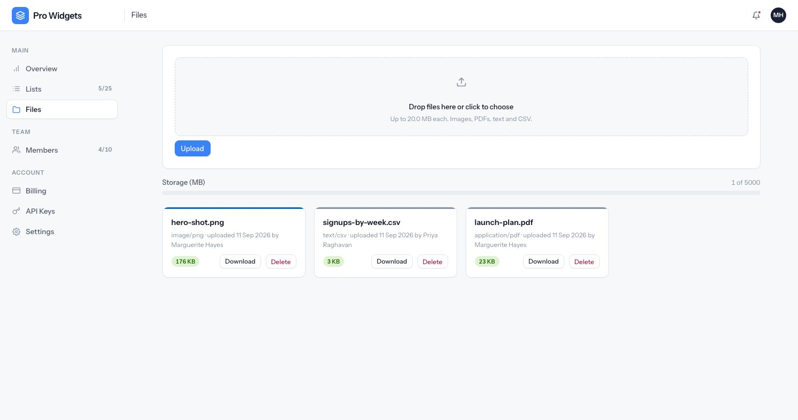

# Files

Uploads belong to the workspace, count against its plan, and are served by redirect to a signed URL
rather than proxied through the application.



---

## What is accepted

| | |
|---|---|
| Extensions | `png`, `jpg`, `jpeg`, `gif`, `webp`, `pdf`, `txt`, `csv` |
| Per file | 20 MB |
| Per workspace | The plan's storage limit (100 MB free, 5 GB Pro, 100 GB Business) |

Those are three different ceilings and they are easy to conflate: a per-file cap, a plan-wide quota,
and — behind both — a slightly larger multipart body limit, so a 20 MB file still has room for the
rest of the form.

**The size is re-measured on the server.** Nothing trusts what the browser reported.

### Type sniffing

The extension is checked against an allowlist, then the *content* is checked against the extension:

- Images and PDFs are identified by their magic bytes.
- Text and CSV are proven negatively — no NUL bytes, and the file must not begin with `<`, which is
  what stops an HTML file being uploaded as `notes.txt` and later served back to somebody.

**A mismatch is a refusal, never a silent correction.** A PNG named `.pdf` does not get renamed; it
gets rejected.

---

## Where files go

Object keys look like this:

```
orgs/<workspace public id>/<year>/<month>/<uuid>.<ext>
```

The workspace comes first, so a bucket policy or an "export everything for this customer" is a
prefix operation. The filename is a random UUID — **never the name the client sent**, which removes
a whole family of path-traversal tricks. The original name is kept in the database for display and
for the download header.

Locally both disks are directories under `storage/`. In production `DRIVE_DISK=r2` points them at
Cloudflare R2. They are named for their purpose rather than their vendor: **private** is the default,
and only avatars and workspace logos go on **public**.

---

## Quota accounting

A workspace carries a byte counter, and it is only ever changed **inside the same transaction** as
the file row it belongs to — never as a follow-up write that could fail on its own.

The quota is compared in bytes and only rounded up to megabytes for the meter, so an upload cannot
slip through on rounding. The upload itself happens before the row exists, so a failed insert never
leaves a file the database does not know about; if the transaction fails, the object is deleted
again.

A nightly job compares the counter against the sum of the rows, and looks for objects in the bucket
with no row. It **reports** what it finds and never silently repairs it: a mismatch is a bug worth
reading, not something to paper over.

{: .note }
Support ticket attachments are allowed past a full quota — a customer who has hit their limit can
still send a screenshot to ask about it. The bytes are still counted.

---

## Deleting

Deleting is soft, and the quota is released immediately. The object itself stays for **30 days**
before a purge job removes it, object first and row second. Until then it can be recovered.

---

## Serving

Requesting a file redirects the browser at the storage layer instead of streaming bytes through the
app:

- **Public** files get a plain CDN URL.
- **Private** files get a **signed URL that expires in 15 minutes**.

Access control happens before the redirect: the lookup is scoped to the workspace, so another
workspace's file id is "not found" rather than "forbidden". The file model deliberately has no `url`
property — going through the storage service is the only way to get one, which keeps the signing
policy in a single place.
