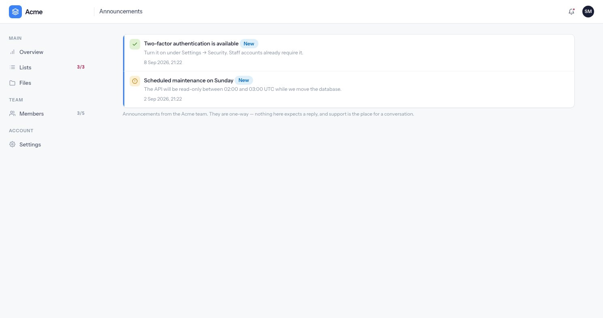

# Notifications

Announcements are one-way notices from the people who run the product to the people using it. They
are not a conversation — that is what [support](support.md) is for.

---

## The one table that crosses tenants

Announcements are the only customer-facing records with no workspace column. Reaching across
workspaces *is* the feature. Because of that, who sees an announcement is decided by a single
predicate rather than by a query, and that predicate is closed by default: an audience type it does
not recognise matches nobody.

An announcement that reaches nobody is a support ticket. One that reaches everybody by accident is
an incident.

| Audience | Who sees it |
|---|---|
| `all` | Everybody |
| `plan` | Workspaces on one of the listed plans |
| `owners` | Workspace owners |
| `users` | Specific people |

{: .warning }
The empty list means opposite things in two of those. For `plan`, an empty list of plans matches
**nobody**. For `owners`, an empty list means **any plan**. This is deliberate, and it is the single
easiest thing to get wrong when writing one.

Before publishing, the back office shows how many people an announcement will reach, calculated with
the very same predicate rather than a second implementation that could disagree.

---

## Publishing

Writing an announcement **publishes it immediately** unless you explicitly save it as a draft.
Opt-out rather than opt-in, on the grounds that a form somebody just filled in and submitted was
meant to go out.

Announcements can carry a level (info, success, warning), an optional action link, and an optional
expiry. Deleting one is soft: it vanishes from every feed at once and is purged after 30 days.

**Deleting does not unsend.** Anybody who already read it still read it, and the confirmation message
says so.

---

## Unread, and the dot on the bell

There is no join table tracking who read what. Each person carries a single "announcements seen at"
timestamp, and anything published after it is new.

That has one consequence worth knowing. The feed is read **first** and the timestamp stamped
**after** — reverse those two and nothing would ever appear new. And the comparison is strictly
"published after you last looked", so an announcement published in the same second as a page load
shows no dot on that load. That was chosen on purpose: the alternative is a dot that stays lit on
something you have already read, which is a visibly wrong answer rather than an invisible one that
corrects itself on the next page view. The announcement itself is never missing from the feed.

The bell and its dot are computed on every authenticated page load, which is also where the support
count beside the account menu comes from.
