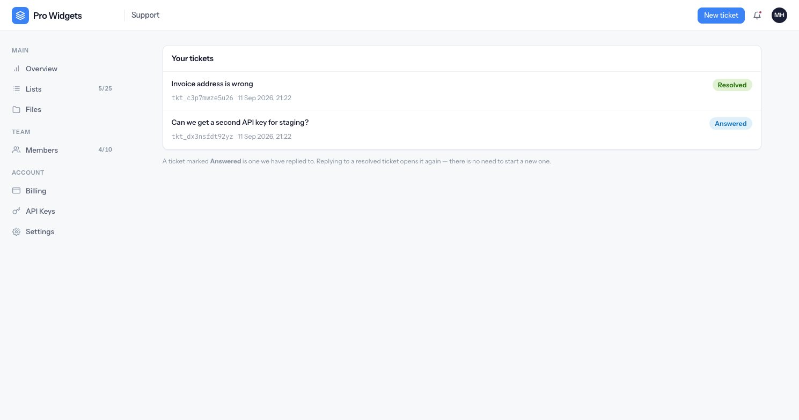
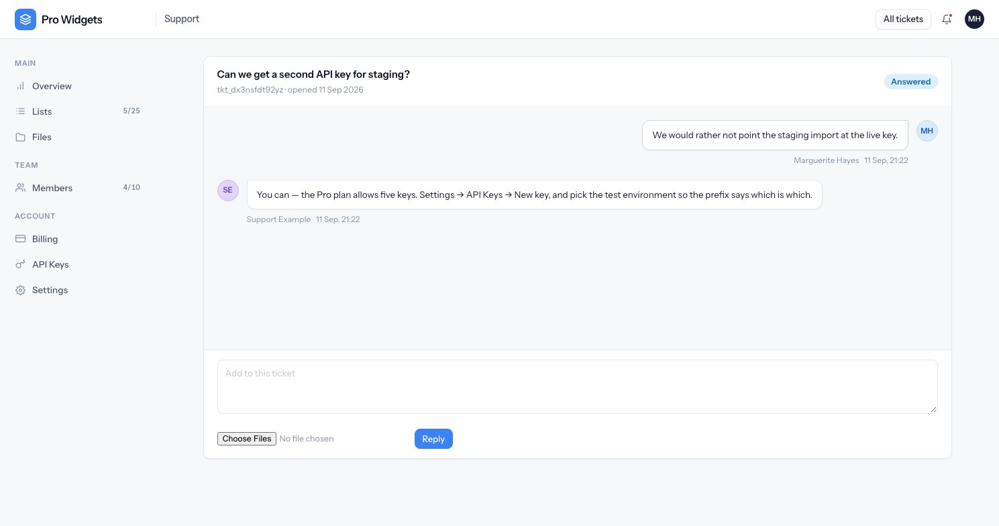
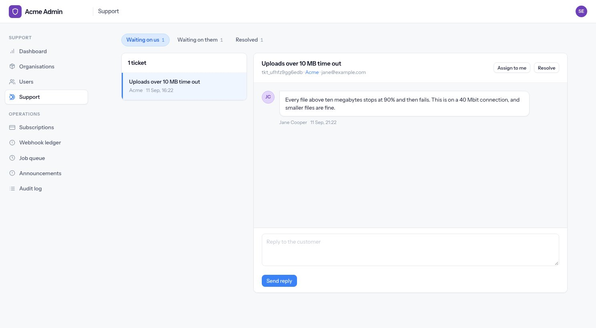

# Support

Conversations between a workspace and the people who run the product. Three states, no email
threading, and a queue that deliberately crosses tenants.

---

## From the customer's side

Any member can open a ticket — it is not owner-only and not gated by plan.

**Who sees what is narrower than everywhere else in the product.** Lists and files are visible to the
whole workspace; tickets are not:

- A **member** sees only their own tickets.
- An **owner** sees every ticket in the workspace.

A ticket can contain a billing dispute or a complaint about a colleague, which is why it does not
follow the usual workspace-wide rule.

Attachments are tighter than general uploads too: at most three per message, 5 MB each, images and
PDFs only. They are allowed past a full storage quota — somebody at their limit can still send a
screenshot about it — and they always land on the private disk behind a signed URL that is minted
only after the ticket has been authorised.

Rate limits: five new tickets an hour, thirty replies an hour, per account.

---

## The three states

| State | Meaning |
|---|---|
| `open` | Waiting on us |
| `answered` | Waiting on them — staff have replied |
| `resolved` | Done, until somebody replies again |

The transitions are the whole model:

- Opening a ticket makes it **open**.
- A staff reply makes it **answered**, and stamps the first-response time once and never again.
- A customer reply makes it **open** again — **including on a resolved ticket**. That is how
  reopening works; there is no separate reopen action, and the reply box on a resolved ticket says
  as much.
- Staff resolving it makes it **resolved**.

There is no `closed`. Three states, and every one of them is set in one service — no controller
writes a status directly.

### "Unread" is just `answered`

The count next to Support in the account menu is the number of your tickets in the **answered**
state. There is no separate seen-at column: a ticket you have read but not replied to still counts,
because from the product's point of view the ball is still in your court.

---

## From the staff side

The queue is cross-tenant by design — every workspace's tickets in one list, filtered by state, with
the conversation beside it.

Any staff member can answer, resolve and assign. **Assignment is a note, not a lock**: it says "I am
dealing with this one", and it never stops anybody else replying.

When staff reply, an email goes to **the person who opened the ticket** — not to the workspace owner,
even though owners can read every ticket. The email links back to the ticket and says plainly that
replying to it does nothing; inbound mail parsing is out of scope.

Staff-side replies are not rate-limited. Only the customer-facing routes are.
