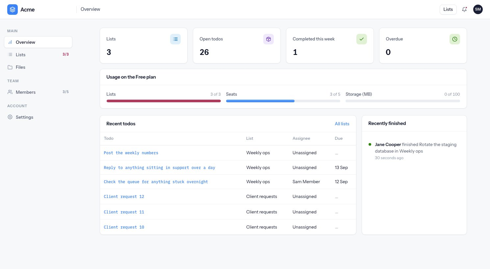
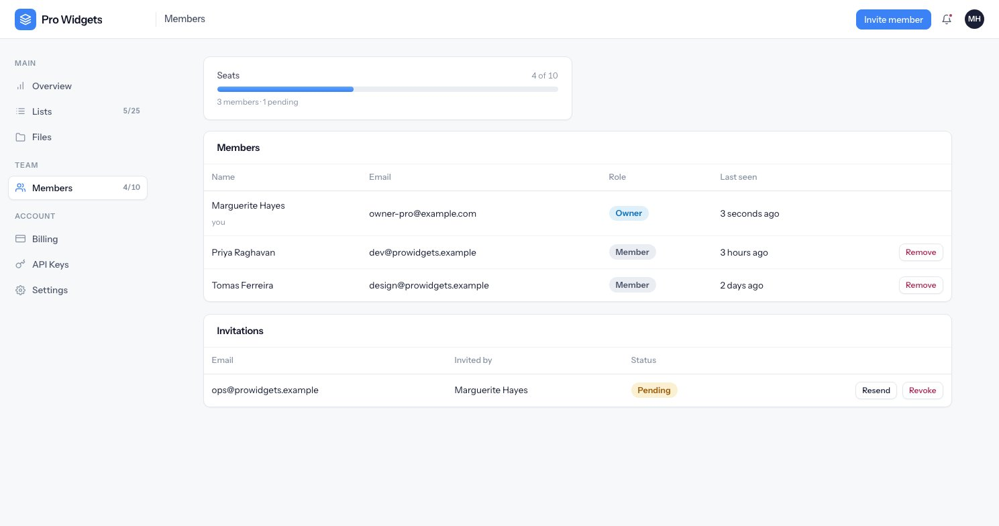

# Tenancy

Every row of customer data belongs to an **organization** — a workspace. This page is about how a
request finds its workspace, and what stops it finding somebody else's.

---

## One user, one workspace

A user belongs to exactly one organization, through a column on the users table rather than a join
table. Signing up creates the workspace and its owner together, in a single transaction, so a
failure halfway through leaves nothing behind.

Each workspace has a slug derived from its name, disambiguated with a numeric suffix when taken.
Reserved words (`admin`, `api`, `login`, `signup` and friends) are blocked, so a workspace can never
claim a system route.

There are exactly two roles.

| | Owner | Member |
|---|---|---|
| See lists, todos, files, team | yes | yes |
| Create and edit lists and todos | yes | yes |
| Upload files, open support tickets | yes | yes |
| Delete a list | yes | — |
| Invite and remove people | yes | — |
| Billing, plans, API keys | yes | — |
| Rename, transfer or delete the workspace | yes | — |

There is one owner per workspace. Ownership can be transferred, and the code refuses any operation
that would leave a workspace with none.

The navigation is gated to match, so a member is never shown a screen that would then refuse them.
Compare the sidebars — the member has no Billing and no API Keys:

---

## How a request finds its workspace

The session carries a user id and nothing else. On every request:

1. The auth middleware loads the user and rejects them if the account has since been removed. Losing
   access takes effect on the next request, not whenever the session happens to expire.
2. `RequireOrganizationMiddleware` re-derives the workspace from that user, refuses it if the
   workspace is soft-deleted or suspended, and attaches it to the request.
3. Every query is then explicitly scoped to that workspace.

There is no global query scope doing this implicitly. Each service takes the organization and filters
by it — verbose, but visible at every call site rather than hidden in a base class.

---

## What stops cross-tenant access

Four independent things, so that no single mistake is enough:

- **The session never names a workspace.** You cannot ask for a different one; it is derived from
  who you are.
- **Lookups are scoped, not checked afterwards.** A record is fetched *within* the workspace filter,
  rather than fetched and then compared. Another workspace's id therefore comes back as "not found"
  rather than "forbidden", which also means an id cannot be used to probe what exists.
- **Policies re-check membership independently**, and take the actor explicitly rather than reading
  the current session. The same checks therefore hold for an API key or an impersonating staff
  member.
- **The database enforces it too.** A todo carries its own `organization_id` alongside its list, and
  a composite foreign key makes it impossible for the two to disagree.

{: .note }
A cross-tenant id passed into a *write* is rejected rather than quietly ignored. Assigning a todo to
a user from another workspace is a validation error, not a silent unassign.

---

## Workspace status

| Status | Access | Set by |
|---|---|---|
| `active` | Normal | — |
| `past_due` | **Full access**, with a banner | A failed payment |
| `suspended` | **Denied**, everyone signed out on the next request | Staff, by hand |

Only `suspended` denies access. A failed payment never does — see
[Billing and plans](billing-and-plans.md).

---

## The team

Seats are managed from the Members screen:

A **seat is a member or an open invitation**. Inviting somebody takes the seat straight away, which
stops ten invitations on a two-seat plan from all appearing to succeed and then failing at the worst
moment — when people try to accept.

Invitations, in detail:

- The link carries a random token; only its hash is stored. The plaintext exists in the email and
  nowhere else.
- They last 14 days, and the status you see (pending, accepted, revoked, expired) is computed from
  timestamps rather than stored, so it cannot drift.
- **Resending issues a new link and revokes the old one.** The previous link stops working.
- The seat check runs inside the same transaction as the invitation, behind a lock on the workspace
  row, and again when the invitation is accepted in case the workspace filled up in between.
- You cannot invite somebody who already belongs to another workspace. One user, one workspace.
- Accepting an invitation verifies the email address by itself — the invitee never gets a separate
  verification mail.

---

## Staff are not users

Staff sit in their own table, behind their own guard and their own login. There is no column and no
flow that promotes a customer into staff, and no way for a staff row to turn up inside a
workspace-scoped query.

Because the two use separate session keys, a staff member can be signed into the back office and
impersonating a customer at the same time without either session disturbing the other. See
[The back office](back-office.md) for what impersonation permits and how it is bounded.
