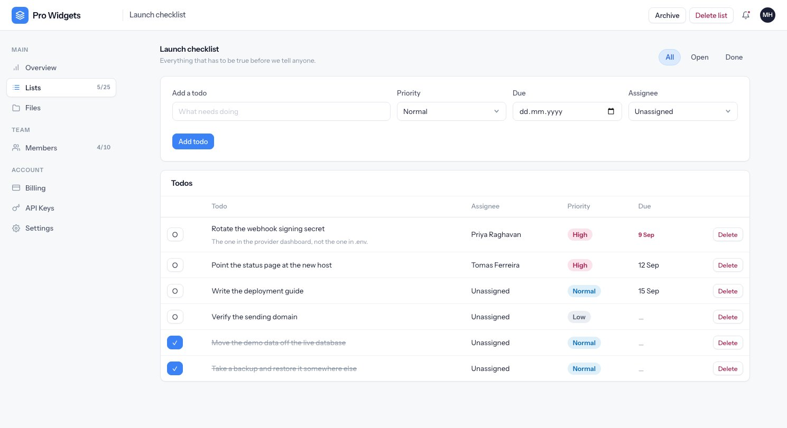
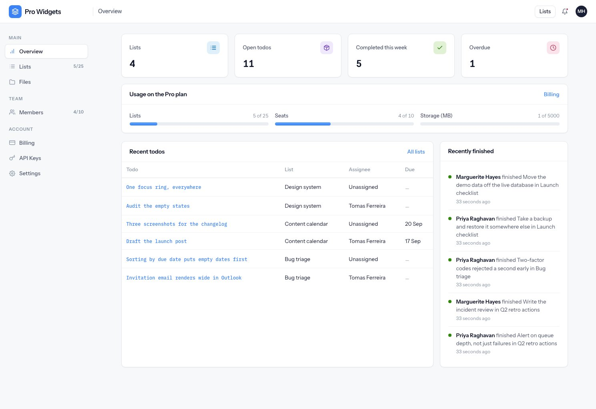

# Lists and todos

The product itself: shared lists of todos. Small on purpose — it exists so the tenancy, quota and
billing machinery has something real to act on.

---

## Lists

A list belongs to the **workspace**, not to whoever made it, so every member sees every list. The
creator is recorded as provenance and is never an access check.

Each list has a name, an optional description, and a colour chosen from the design tokens
(`blue`, `green`, `orange`, `purple`, `red`, `gray`) — never a hex value, so a list cannot land
outside the palette. Names must be unique within a workspace, which is enforced in the create and
rename transaction rather than by a database constraint, because SQLite has no partial indexes and
this project runs on SQLite and Postgres both.

### Archive versus delete

|  | Archive | Delete |
|---|---|---|
| Who | Any member | Owner only |
| Effect | Hidden from the list screen | Soft-deleted, with all its todos |
| Reversible | Yes | Not through the UI |
| Frees a quota slot | **No** | Yes |

That first row of the last line is the one that surprises people: **an archived list still counts
against your list limit.** Archiving tidies a screen; it does not buy headroom.

---

## Todos

A todo has a title, optional notes, a priority (`low`, `normal`, `high`), an optional due date, an
optional assignee, and a position. Filters across the top switch between all, open and done.

Some deliberate choices worth knowing:

- **Completion is a timestamp, not a flag.** That is where "completed this week" comes from, and
  un-completing clears the time and the person together.
- **Overdue means: has a due date, not complete, and that date has passed.** A completed todo is
  never overdue however late it was.
- **An assignee from another workspace is rejected**, not silently dropped.
- **Removing somebody from the workspace unassigns their todos**; it never deletes them.
- **Ordering uses sparse positions** with gaps, so a drag writes one row rather than renumbering the
  list. When two neighbours end up adjacent, a background job re-spreads the positions and the
  request asks you to retry.

{: .warning }
Completed todos still count against the per-list limit. A list at its cap stays capped until todos
are deleted or moved — ticking them off does not free room.

---

## The dashboard

Four numbers, all scoped to the workspace:

- **Lists** — not deleted, not archived.
- **Open todos** — across every list.
- **Completed this week** — completed in the last seven days.
- **Overdue** — open, with a due date in the past.

Underneath sit the six newest open todos and the six most recently finished, with usage meters for
the plan above them.

"Completed this week" and "overdue" are filtered in application code rather than in SQL. A timestamp
compared against a bound value means subtly different things on SQLite and Postgres, and getting a
count quietly wrong on one engine is worse than the extra rows.
